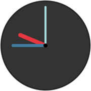

# React Clock Component

This is a simple reusable clock React component to display time in an analogue clock format. See examples below.

## Project prerequisite

1. [Node, NPM](https://nodejs.org/en/download/)
2. [Storybook](https://www.npmjs.com/package/@kadira/storybook#getting-started)

## Managing NPM dependencies

This project uses `yarn` instead of `npm`. To make sure you have the correct version of npm packages please use ```yarn install``` instead of ```npm install```.

[Check out yarn!](https://www.sitepoint.com/yarn-vs-npm/)


## Development Setup

This component has been setup with [React CDK](https://github.com/kadirahq/react-cdk) and help us to focus on the component development.

### QuickStart

* Your component is at `src/index.js`. Open it with an editor.
* Start React Storybook with: `npm run storybook` (stories at `src/stories/index`).
* Watch for tests with: `npm run test-watch` (tests at `src/tests`).

### Source Files

Source files on this project lives under `src` directory and you can write your component using ES2015+. (with babel-preset-stage-2).

`src/index.js` is the main entrypoint in this component and you should expose a React component class from that module(file).

### Developing with React Storybook

[React Storybook](https://github.com/kadirahq/react-storybook) is configured with this component and you can use it to develop your component without a need of an app.

You can try different states of your components very easily. You can [write](https://github.com/kadirahq/react-storybook/blob/master/docs/api.md#story-creation-api) React Storybook stories inside the `src/stories/index.js`.

You can run `npm run storybook` to start the React Storybook console.

To learn more about React Storybook, visit [here](https://github.com/kadirahq/react-storybook).

### Testing with Mocha and Enzyme

This component is configured to use [Mocha](https://github.com/mochajs/mocha) and [Enzyme](https://github.com/airbnb/enzyme). It's also setup for JSDOM so, you can get the [full use](https://github.com/airbnb/enzyme/blob/master/docs/api/mount.md) of enzyme.

You can write your test cases in `src/tests` directory. There are few commands to run your tests, here are they:

* `npm run testonly` - Run all the tests
* `npm run test-watch` - Run all the tests and watch for changes
* `npm test` - Same as `npm run testonly`, but also do linting before testing.

### Linting

This component uses [ESLint](http://eslint.org/) for linting and uses a slightly modified version of AirBnb style guide (for JS and React).

Modified rules can be found at `.eslintrc` file.

Use these commands to do the linting:

* `npm run lint` - Run eslint
* `npm run lintfix` - Run eslint with --fix flag

## Using the component

### Default view

    <Clock />


The clock has a default `diameter of 90`, and a `default theme using light colours`. If no time prop is passed in, it will automatically show the time on the user's machine, and it will automatically tick each second to render the current time.

### Setting the size

You can change the size of the clock - small, big - it really doesn't matter.

    <Clock diameter={ 20000 } />

That's probably a bit too big.

### Setting the time (battery out)

    <Clock time="09:45" />



This will create a new clock instance, which displays 12:30. If the time prop is passed to the clock, it will freeze the display and won't tick.

Seconds can also be passed in with the time, but it's really not necessary:

    <Clock time="09:45:00" />

### Using built-in themes

There is a theme for everyone built into the component (well as long as you like the `light` colour theme, or the `dark` one.

    <Clock theme="light" />


### Using custom themes

If your inner stylist can't be satisfied with the `light` or the `dark` themes, feel free to go wild and use your own colours (I can't be held responsible for visual inconvenience caused by 3rd party madness).

      <Clock theme={{
        bezel: 'red',
        face: 'blue',
        hour: 'black',
        minute: 'yellow',
        second: 'rgba(0, 0, 0, 0)' }}
      />


The above example creates a clock instance for people with no taste. Please kindly note how we hide the second hand here. Tricks!

## Demo

[https://robertpataki.github.io/react-clock](https://robertpataki.github.io/react-clock)

## To do

- Use RAF instead of setInterval
- See if there is a way to write a unit test to check the timer being stopped on `componentWillUnmount`


[1]: ./docs/react-clock-01-default.png
[2]: ./docs/react-clock-02-custom-size.gif
[3]: ./docs/react-clock-03-battery-out.png
[4]: ./docs/react-clock-04-light-theme.png
[5]: ./docs/react-clock-05-custom-theme.png
